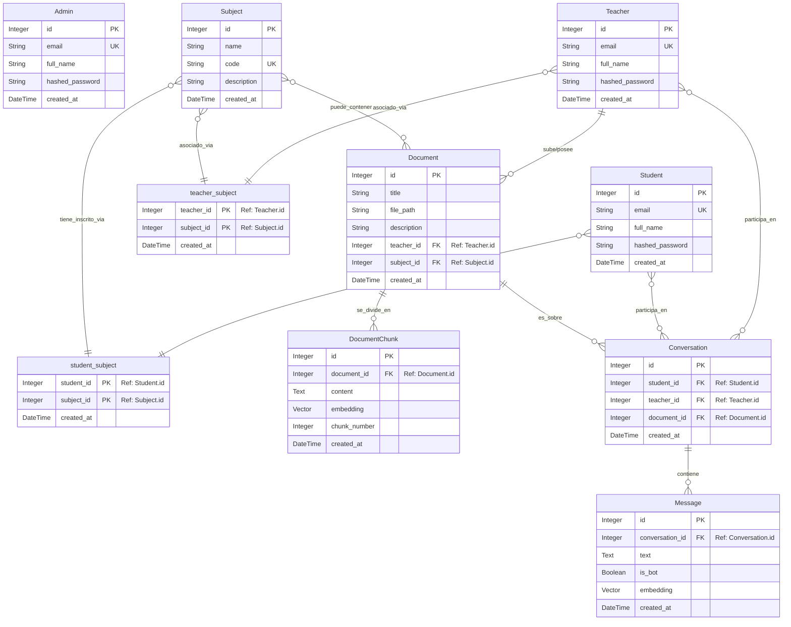

# Diagrama ERD de la Base de Datos

```mermaid
erDiagram
    Admin {
        Integer id PK
        String email UK
        String full_name
        String hashed_password
        DateTime created_at
    }

    Teacher {
        Integer id PK
        String email UK
        String full_name
        String hashed_password
        DateTime created_at
    }

    Student {
        Integer id PK
        String email UK
        String full_name
        String hashed_password
        DateTime created_at
    }

    Subject {
        Integer id PK
        String name
        String code UK
        String description
        DateTime created_at
    }

    teacher_subject {
        Integer teacher_id PK "Ref: Teacher.id"
        Integer subject_id PK "Ref: Subject.id"
        DateTime created_at
    }

    student_subject {
        Integer student_id PK "Ref: Student.id"
        Integer subject_id PK "Ref: Subject.id"
        DateTime created_at
    }

    Document {
        Integer id PK
        String title
        String file_path
        String description
        Integer teacher_id FK "Ref: Teacher.id"
        Integer subject_id FK "Ref: Subject.id"
        DateTime created_at
    }

    DocumentChunk {
        Integer id PK
        Integer document_id FK "Ref: Document.id"
        Text content
        Vector embedding
        Integer chunk_number
        DateTime created_at
    }

    Conversation {
        Integer id PK
        Integer student_id FK "Ref: Student.id"
        Integer teacher_id FK "Ref: Teacher.id"
        Integer document_id FK "Ref: Document.id"
        DateTime created_at
    }

    Message {
        Integer id PK
        Integer conversation_id FK "Ref: Conversation.id"
        Text text
        Boolean is_bot
        Vector embedding
        DateTime created_at
    }

    Teacher ||--o{ Document : "sube/posee"
    Teacher }o--o{ Conversation : "participa_en"
    Teacher }o--|| teacher_subject : "asociado_via"
    Subject }o--|| teacher_subject : "asociado_via"

    Student }o--o{ Conversation : "participa_en"
    Student }o--|| student_subject : "inscrito_via"
    Subject }o--|| student_subject : "tiene_inscrito_via"

    Subject }o--o{ Document : "puede_contener"

    Document ||--o{ DocumentChunk : "se_divide_en"
    Document ||--o{ Conversation : "es_sobre"

    Conversation ||--o{ Message : "contiene"
```